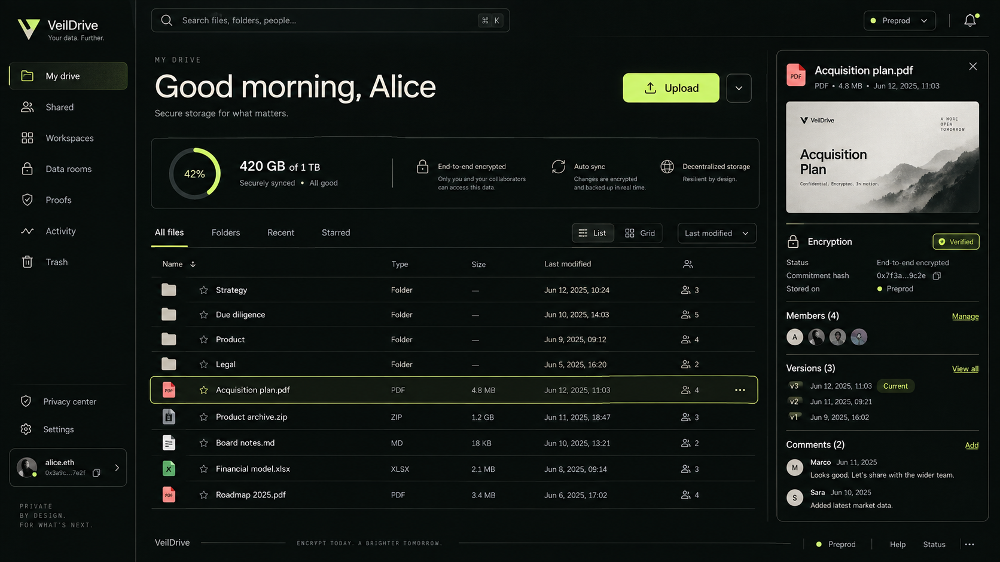

# VeilDrive

**Your files. Your keys. Your privacy.**

VeilDrive is a privacy-first encrypted drive and proof exchange for Midnight preprod. Files and readable metadata are encrypted in the browser; Midnight carries commitments, ownership, grants, credential policies, revocation, and private audit receipts.



## What is implemented

- Client-side AES-256-GCM file and metadata encryption with per-file keys, AES-KW wrapping, and an unexportable device master key.
- Encrypted IndexedDB blob vault, encrypted previews/downloads, folders, search, favorites, tags, trash, comments, and version history.
- A compiling Compact contract with 17 circuits for file lifecycle, wallet grants, credential policies, expiry, one-time use, credential issuance/revocation, and audit verification.
- DApp Connector API v4 wallet discovery for compatible Midnight wallets, including Lace and 1AM, on `preprod`.
- Deploy or join a VeilDrive registry, persisted encrypted private state, wallet transaction balancing/submission, wallet-delegated proving, and a local proof-server fallback.
- Private workspaces, member roles, Veil IDs, credentials, access requests, confidential data rooms, external capability links, privacy inspector, document verification, recovery planning, notifications, and a typed SDK.
- Responsive installable PWA UI, reduced-motion support, generated art direction, lazy routes, and offline app-shell caching.

The product deliberately does not claim DRM. Revoking a grant blocks future authorized retrievals; it cannot erase plaintext or keys already obtained by a recipient. The currently included blob provider is device-local IndexedDB. Cross-device external delivery requires deploying an encrypted object-storage adapter; disabled IPFS/S3 controls make that boundary explicit.

## Prerequisites

- Node.js 22 or newer
- pnpm 11
- WSL2 on Windows for the Compact compiler image
- Docker available inside WSL (or Docker on Linux/macOS)
- A DApp Connector API v4-compatible wallet configured for Midnight preprod

The repository pins the current compatible stack: Midnight JS `4.1.1`, DApp Connector API `4.0.1`, Compact compiler `0.31.1`, and proof server `8.1.0`.

## Quick start

```bash
pnpm install
pnpm contract:compile:wsl
pnpm proof-server
pnpm dev
```

Open `http://localhost:5173`, connect a compatible wallet, and use **Settings → Deploy new registry / Join registry**. VeilDrive starts as an empty vault and does not seed files, people, grants, credentials, or receipts.

On Windows, `pnpm proof-server` automatically runs Docker through WSL and reuses the named container. Useful commands:

```bash
pnpm proof-server:status
pnpm proof-server:stop
```

The preprod faucet is <https://midnight-tmnight-preprod.nethermind.dev/>. Contract transactions require sufficient NIGHT and DUST in the connected wallet.

## Verify everything

```bash
pnpm check
```

This runs lint, browser cryptography tests, all Compact simulator tests, SDK tests, contract bindings, ZK asset synchronization, TypeScript, and the production build.

## Project map

```text
contract/                    Compact contract, private witnesses, simulator tests
sdk/                         Typed standalone SDK and transport interface
src/lib/crypto.ts            Browser encryption, wrapping, commitments
src/lib/midnight.ts          Preprod wallet discovery and network health
src/lib/midnight-contract.ts Real Midnight providers and contract calls
src/store/AppStore.tsx       End-to-end application workflows
src/pages/                   Drive, teams, proofs, data rooms, admin, settings
public/keys + zkir            Generated proving/verifier assets (build-time copy)
docs/                        Architecture, security, and preprod runbook
```

See [Architecture](docs/ARCHITECTURE.md), [Security model](docs/SECURITY.md), and [Preprod runbook](docs/PREPROD.md).

## Midnight references

- [Wallet integration](https://docs.midnight.network/sdks/community/wallets/community-wallets-integration)
- [DApp Connector API](https://docs.midnight.network/api-reference/dapp-connector)
- [Compact installation and compiler](https://docs.midnight.network/develop/tutorial/using/chrome-ext)
- [Midnight network endpoints](https://docs.midnight.network/relnotes/midnight-node)

## License

Apache-2.0. See [LICENSE](LICENSE).
